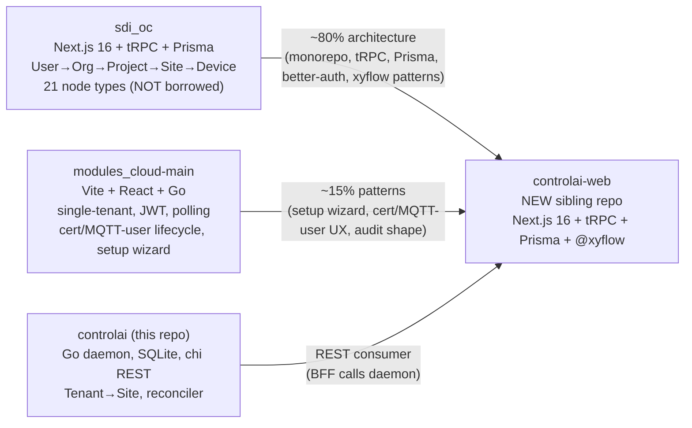

# Plan: controlai-web MVP — 4 OpenSpec Changes

## Background & Research

### Origin & Verbatim User Ask

From `/tmp/controlai-web-handoff.md` line 11:

> "now think of the new way of implementing the gui for this project. ... the program and application should be modular. you could consider making a new work directory controlai-web. the goal is to create a account and project and thus site based sensor-gateway-broker-ingest-timescale configuration provisioning and monitoring using a node editor. Use both modules_cloud-main and sdi_oc as reference."

### Reference Artifacts (worker MUST read these every iter)

- **Handoff brief**: `/tmp/controlai-web-handoff.md` — full prior-session context, 10 open questions, recommended OpenSpec shape, 16 design decisions to validate.
- **Research — better-auth multi-tenant**: [`.slash/workspace/research/better-auth-multi-tenant-2026-05-24T00-40-30Z.md`](.slash/workspace/research/better-auth-multi-tenant-2026-05-24T00-40-30Z.md) — v1.6.11 stable, organization plugin first-class, Prisma adapter, session strategy, invite flow.
- **Research — xyflow v12 patterns**: [`.slash/workspace/research/xyflow-react-patterns-20260524T004044Z.md`](.slash/workspace/research/xyflow-react-patterns-20260524T004044Z.md) — Next.js App Router SSR, `'use client'` boundary, custom node types, isValidConnection matrix, persistence shape, license/Pro boundary.
- **Research — MQTT→SSE bridge**: [`.slash/workspace/research/mqtt-sse-bridge-20260524T004100Z.md`](.slash/workspace/research/mqtt-sse-bridge-20260524T004100Z.md) — mqtt.js v5 mTLS, multi-broker registry, Next.js SSE route, Upstash Redis Streams, Vercel function timeouts, cross-origin auth options.
- **OpenSpec conventions**: [`openspec/AGENTS.md`](openspec/AGENTS.md) and [`openspec/project.md`](openspec/project.md) — strict mode rules, capability spec format, delta header conventions.

### Three Reference Codebases (inline subagent reports already in conversation history)



**Key file pointers** (from the subagent maps the worker has access to via this PRD):

controlai daemon (already explored):
- REST: `internal/daemon/server.go:146-192` (router), `:253-411` (tenant CRUD), `:413-629` (site CRUD), `:631-726` (lifecycle), `:928-1018` (apply/convergence), `:1020-1187` (PKI), `:1229-1247` (token auth middleware).
- Schema: `internal/store/sqlite/migrations/0001_init.sql:1-135`.
- Reconciler: `internal/recon/reconciler.go:70-312` (30s tick, exponential backoff 30s→1m→5m→30m).
- Render templates: `internal/render/templates/{tenant/tsdb,site/mosquitto,site/emqx}/*.tmpl`.
- Capacity guard: `internal/capacity/profile.go:1-150` (t3.medium ≤5 tenants enforced via projected MB).
- Audit kinds: `internal/audit/audit.go:1-56`.
- Token CLI: `cmd/controlai/main.go:640-702`.

sdi_oc reference (already explored):
- shared-types: `/Users/8bitnyan/Documents/ThinkTank/sdi_oc/packages/shared-types/src/{organization,project,site,auth}.ts`.
- Prisma: `packages/api/prisma/schema.prisma:1-645` (645 lines, 21 models).
- tRPC routers: `packages/api/src/routers/*.ts` (17 routers).
- Node editor: `apps/web/src/components/node-editor/` — borrow `connection-rules.ts`, `use-undo-redo.ts`, `use-flow-persistence.ts`. Do NOT borrow the 21 node types.
- better-auth wiring: `apps/web/src/lib/auth.ts`, `apps/web/src/app/api/auth/[...all]/route.ts`.

modules_cloud-main reference (already explored):
- Setup wizard 4-step state machine: `web/src/routes/setup.tsx:1-583`.
- Setup state singleton: `internal/store/setup_state.go:9-41`.
- Cert lifecycle: `internal/api/handlers_broker.go:88-142`, `internal/store/certificates.go:58-197`.
- MQTT-user lifecycle: `internal/api/handlers_group_users.go:59-204`.
- JWT auth (no refresh): `internal/api/middleware.go:52-110`.

### Confirmed Decisions Table (all 38 interview Q→A + 2 recommendations)

| # | Topic | Decision |
| --- | --- | --- |
| D1 | Spec split | **Two changes** (`add-controlai-web-skeleton` + `add-controlai-web-pipeline-ux`) + **2 cross-cut** (`add-daemon-https-via-traefik`, `add-project-tag`) |
| D2 | Node editor v1 | **Full CRUD + Apply** (drag, connect, save, dry-run, apply) |
| D3 | Hosting Phase 1 | **Vercel + cross-origin to federated daemons** |
| D4 | Multi-instance | **Federation: one web ↔ many daemons** |
| D5 | Sign-up | **Public email+password** (open SaaS) |
| D6 | Email verification | **Not required** (dev-friendly, accept risk) |
| D7 | Apply semantics | **Dry-run preview → confirm → commit serially** |
| D8 | Live data on nodes | **Status dot + msg/sec counter** (no sparkline v1) |
| D9 | Pipeline templates | **v2 — out of scope** |
| D10 | Telemetry cache | **Upstash Redis Streams** (fall back to TimescaleDB) |
| D11 | BFF→daemon auth | **Bearer token via daemon CLI** (`controlai token create`) |
| D12 | Repo + license | **Public `8bitnyan/controlai-web`, MIT** |
| D13 | Project layer | **controlai-web owns Project; daemon gets nullable `project_id TEXT` column** |
| D14 | Daemon HTTPS | **Traefik + Let's Encrypt** (no daemon code change) |
| D15 | Federation registry | **Org-scoped `ControlaiInstance`; Project has required `controlaiInstanceId`** |
| D16 | Instance health | **Periodic BFF poll** of `/v1/health` every 60s; stores lastSeenAt/version/capacityUsedMB/capacityAllowedMB |
| D17 | Abuse mitigation | **Nothing in v1** (accept risk; note in design.md) |
| D18 | Cross-cut specs | **Both `add-daemon-https-via-traefik` + `add-project-tag`** (3rd cross-cut `add-daemon-multi-broker-per-site` **REVERSED** — see Recommendation A) |
| D19 | Skeleton/features split | Skeleton = repo+monorepo+auth+domain+instance-registry; Features = node-editor+provisioning+monitoring+dashboard |
| D20 | Hierarchy | **User → Org → ControlaiInstance → Project → SiteGroup → Site → (mapped to daemon Tenant+Site)** |
| D21 | Node types | **Sensor, Gateway, Broker, Ingest, TimescaleDB, Monitoring** (6 types) |
| D22 | Site/broker model | **`SiteGroup` is the user-facing logical site; `Site` is 1:1 with daemon Site (one broker). Multiple protocols at one location = multiple Sites under one SiteGroup.** (Recommendation A) |
| D23 | Apply orchestration | **BFF computes ordered plan + executes serially + polls reconciler between steps** |
| D24 | MQTT bridge host | **Phase 1: Fly.io; Phase 2: dedicated EC2 sidecar** (Recommendation B). Plan documents Phase 1; Phase 2 is a follow-up change. |
| D25 | SSE auth | **Browser connects DIRECTLY to mqtt-bridge (`stream.controlai.app`), not via Vercel.** Short-lived HS256 JWT issued by Vercel tRPC `stream.token({siteId})` endpoint, browser passes as `?token=` to `EventSource`, mqtt-bridge verifies stateless. |
| D26 | Redis host | **Upstash Redis** (`@upstash/redis`) |
| D27 | Instance discoverability | **Manual: operator runs `controlai token create web-bff` on each EC2, pastes URL+token into UI** |
| D28 | MVP defers | **Templates, sparklines, multi-site graph, audit UI, per-project RBAC** are all v2 |
| D29 | Postgres host | **Neon Postgres** (`@neondatabase/serverless`) |
| D30 | Default project access | **Org OWNER/ADMIN can edit; MEMBER view-only** (no per-project RBAC in v1) |
| D31 | Testing stack | **Vitest (unit + tRPC) + Playwright (E2E happy paths)** |
| D32 | Seed data | **Setup wizard**: first user becomes sysadmin, creates first Org, prompts to add first ControlaiInstance |
| D33 | mqtt-bridge stack | **Node.js + Hono + mqtt.js + ioredis** |
| D34 | Token rotation | **Manual via UI** (paste new token; old revoked on daemon side separately) |
| D35 | Audit log | **Write events in v1, no UI** (`AuditLog` Prisma model + write path; surfaced via Prisma Studio) |

### Architecture Diagram (target end-state)

```mermaid
flowchart TB
  subgraph br [Browser]
    UI["Next.js SSR + React 19<br/>@xyflow/react canvas<br/>echarts dashboards<br/>EventSource → stream service"]
  end
  subgraph vercel [Vercel — controlai-web Next.js]
    BFF["tRPC server<br/>routers: auth, org, project, siteGroup, site,<br/>instance, nodeConfig, apply, stream.token, audit"]
    DB[("Neon Postgres<br/>users/orgs/projects/siteGroups/sites/<br/>instances/nodeConfigs/sessions/audit")]
  end
  subgraph fly [Fly.io / EC2 — mqtt-bridge service]
    MB["Hono + mqtt.js<br/>multi-broker registry<br/>SSE fanout per site<br/>JWT verify (HS256 shared secret)"]
    RD[("Upstash Redis Streams<br/>last 1000 msgs per (site,topic)")]
  end
  subgraph fed [Federated controlai EC2 hosts]
    TR["Traefik<br/>api.<deployment>.sslip.io<br/>Let's Encrypt TLS"]
    DAEMON["controlai daemon<br/>chi REST + bearer token<br/>SQLite + Docker"]
    BR["Mosquitto / EMQX<br/>per-site brokers"]
    TS[("TimescaleDB<br/>per-tenant")]
  end
  UI -->|tRPC over HTTPS<br/>cookie session| BFF
  UI -.->|SSE telemetry<br/>?token=<jwt>| MB
  BFF --> DB
  BFF -->|HTTPS + bearer token<br/>federated| TR
  TR --> DAEMON
  DAEMON --> BR
  DAEMON --> TS
  MB -.subscribe MQTT mTLS.-> BR
  MB --> RD
  BFF -.stream.token signs JWT.-> MB
```

### Spec Direction Statement (worker MUST honor)

The four OpenSpec changes together describe how to bring the architecture above into existence. **No code is written in this run** — only OpenSpec markdown. The actual controlai-web repo creation is part of `add-controlai-web-skeleton/tasks.md` (a checklist task), executed in a future session, not in this convergence run.

## Testing Plan

This run produces only OpenSpec markdown. The "testing" of this run is `openspec validate <changeId> --strict` for each of the 4 changes, which the OpenSpec CLI runs against the proposal/design/tasks/specs structure and delta headers.

### Acceptance criteria for each change

For **all 4 changes**:
- Directory `controlai/openspec/changes/<changeId>/` exists.
- Contains `proposal.md`, `design.md`, `tasks.md`, and `specs/<capability>/spec.md` for every capability the change adds/modifies.
- `openspec validate <changeId> --strict` exits 0.
- Every spec delta uses the correct header (`## ADDED Requirements`, `## MODIFIED Requirements`, `## REMOVED Requirements`).
- Every requirement has at least one scenario (per OpenSpec strict mode).
- Tasks are written as `- [ ]` checkboxes with stable numbering.

For **proposal.md** (every change):
- `## Why` section: motivation grounded in the verbatim user ask + decisions table.
- `## What Changes` section: bullet list of deltas.
- `## Impact` section: lists affected specs + breaking changes (none for new specs; the cross-cut changes are ADDITIVE — no breaking).

For **design.md** (every change):
- Architecture diagram(s) in mermaid.
- Decisions table with rationale (cite the D# from the PRD table above where relevant).
- Alternatives considered + why rejected.
- Risks / open questions list.

For **tasks.md**:
- Sections grouped logically (1. Repo bootstrap, 2. Monorepo setup, ..., 10. Acceptance).
- Atomic tasks (one verb, one outcome per checkbox).
- For `add-controlai-web-skeleton/tasks.md`: target ~80 tasks across 10 sections.
- For `add-controlai-web-pipeline-ux/tasks.md`: target ~100 tasks across 10 sections.
- For cross-cut tasks.md files: target ~20-30 tasks each.

For **spec.md deltas**:
- Capability spec format per `openspec/AGENTS.md`.
- For ADDED specs (controlai-web is greenfield, so all controlai-web spec.md files are ADDED): top-level `## ADDED Requirements` then `### Requirement: <Name>` blocks with WHEN/THEN/AND scenarios.
- For MODIFIED specs (cross-cuts): include both the old and new requirement text per OpenSpec convention.

## Implementation Plan

The 4 OpenSpec changes are largely independent but share the decisions table. Worker authors them in this order to maximize reuse of common header text and avoid contradicting earlier files.

### Phase 1 — Cross-cutting controlai-side changes (small, define preconditions)

- [ ] `cross-https-proposal`: Create `controlai/openspec/changes/add-daemon-https-via-traefik/proposal.md`. Why: controlai-web Vercel BFF requires public HTTPS access to daemon REST. What: extends `add-aws-provisioning` Traefik with a new route `api.<deployment>.sslip.io → controlai:80`, Let's Encrypt cert, no daemon Go code change. Impact: spec `aws-deployment` modified, daemon binary unchanged.
- [ ] `cross-https-design`: Create `add-daemon-https-via-traefik/design.md`. Include mermaid showing Traefik routing + cert acquisition flow. Decisions: ACME HTTP-01 vs DNS-01 (HTTP-01 simpler since 80 already open); cert renewal handled by Traefik built-in; no daemon CORS needed since BFF is server-side (no browser→daemon direct calls).
- [ ] `cross-https-tasks`: Create `add-daemon-https-via-traefik/tasks.md`. Sections: 1. Traefik config delta (add new router rule for `api.` subdomain), 2. Let's Encrypt staging→prod transition steps, 3. Bearer token surface validation (confirm `:1229-1247` middleware path works on TCP listener), 4. Integration test (curl from outside EC2 with token), 5. AWS up.sh changes (open 443 in SG if not already, document new domain). ~20-25 tasks.
- [ ] `cross-https-spec`: Create `add-daemon-https-via-traefik/specs/aws-deployment/spec.md`. Use `## MODIFIED Requirements` since `aws-deployment` already exists from `add-aws-provisioning`. Add a new requirement "WHEN deployment is provisioned, THEN Traefik MUST expose `api.<deployment>.sslip.io` with Let's Encrypt TLS proxying to daemon REST listener" + appropriate scenarios.

- [ ] `cross-projtag-proposal`: Create `add-project-tag/proposal.md`. Why: controlai-web's Project layer needs daemon-side filtering for audit/log queries. What: adds nullable `project_id TEXT` column to `tenants` table; daemon treats it as opaque (passes through in audit + log queries). No reconciler change. Impact: `registry` spec modified, additive only — existing tenants with NULL project_id continue to work.
- [ ] `cross-projtag-design`: Create `add-project-tag/design.md`. Decision: opaque string vs FK to a new daemon-side Projects table (chose opaque — controlai-web owns the canonical Project entity; daemon is dumb consumer). Migration: `ALTER TABLE tenants ADD COLUMN project_id TEXT` — backward-compatible because nullable. Audit query API extension: optional `?project_id=` filter on `/v1/tenants` and audit endpoints.
- [ ] `cross-projtag-tasks`: Create `add-project-tag/tasks.md`. Sections: 1. SQLite migration `0002_add_project_id.sql`, 2. Go struct field on Tenant model, 3. REST handler accepts project_id on create/update/list, 4. Audit log records project_id where present, 5. Unit tests, 6. Backward-compat test (existing tenant without project_id). ~20-25 tasks.
- [ ] `cross-projtag-spec`: Create `add-project-tag/specs/registry/spec.md`. `## MODIFIED Requirements`. Modify the tenant requirement to include the optional project_id field; add scenarios for "set on create", "filter on list", "null is allowed".

### Phase 2 — `add-controlai-web-skeleton` (the bigger of the two web changes)

- [ ] `web-skel-proposal`: Create `controlai/openspec/changes/add-controlai-web-skeleton/proposal.md`. Why: ground the entire controlai-web sibling project, capture the verbatim user ask, motivate the federation model. What: introduces 4 new capability specs (shell, auth, domain, instance-registry). Impact: net-new — no existing controlai-web specs to break.
- [ ] `web-skel-design`: Create `add-controlai-web-skeleton/design.md`. Sections: Reference codebases (sdi_oc + modules_cloud-main) with what to borrow; Architecture diagram (mermaid — paste a simpler version of the architecture diagram from this PRD); Hierarchy diagram (User→Org→Instance→Project→SiteGroup→Site); Domain model details (paste Prisma snippets); Decisions table (cite D# from PRD); Hosting (Vercel + Neon + Upstash); Auth posture (open sign-up, no email verification, accept abuse risk); Federation (Org-scoped instances); Phase 1/2 hosting plans for mqtt-bridge (Fly.io now, EC2 later); Risks (open sign-up abuse, single-region Neon).
- [ ] `web-skel-tasks`: Create `add-controlai-web-skeleton/tasks.md`. Sections:
  1. **Repo bootstrap** (`gh repo create 8bitnyan/controlai-web --public --license=MIT`, initial commit, README, license)
  2. **Monorepo & build** (pnpm workspaces, turbo.json, tsconfig.base.json, prettier, eslint matching sdi_oc layout)
  3. **Apps & packages scaffolding** (`apps/web` Next.js 16, `packages/{api,db,shared-types}`)
  4. **Database** (Neon project, Prisma schema for User/Session/Account/Verification/Organization/OrganizationMember/OrganizationInvitation/ControlaiInstance/Project/SiteGroup/Site/AuditLog, migrations)
  5. **Auth** (better-auth + Prisma adapter + organization plugin, email+password, sessions, invite email via Resend stub, `/api/auth/[...all]/route.ts`, signed cookie session, no email verification)
  6. **tRPC setup** (server adapter for App Router, ABAC middleware reading session + verifying org/project scope from path params, error formatter)
  7. **Domain routers** (`org`, `project`, `siteGroup`, `site` CRUD with proper ABAC; ControlaiInstance CRUD with encrypted token storage)
  8. **Instance registry** (`instance.register({name, baseURL, token})`, `instance.health()` cron task via `node-cron` or Vercel cron, status persistence)
  9. **Setup wizard** (4-step state machine like modules_cloud-main: signup→first-org→first-instance→done; setup_state singleton row)
  10. **CI & testing** (GitHub Actions: lint, typecheck, unit (Vitest), Playwright happy-path; Vercel preview deploys; secret management)
  ~80 atomic tasks total.
- [ ] `web-skel-spec-shell`: Create `specs/controlai-web-shell/spec.md`. Requirements: monorepo layout, build/lint/typecheck commands, env var contract (DATABASE_URL, BETTER_AUTH_SECRET, BETTER_AUTH_URL, UPSTASH_REDIS_REST_URL, UPSTASH_REDIS_REST_TOKEN, STREAM_SERVICE_URL, STREAM_JWT_SECRET, etc.), CI workflow contract.
- [ ] `web-skel-spec-auth`: Create `specs/controlai-web-auth/spec.md`. Requirements: email+password sign-in/sign-up (no email verification), session via better-auth DB-backed cookies with cookie cache, organization plugin, invite flow (create invitation→email link→accept→add to org), role enums (OWNER/ADMIN/MEMBER), session revocation on role change. Scenarios for each.
- [ ] `web-skel-spec-domain`: Create `specs/controlai-web-domain/spec.md`. Requirements: Prisma models for Organization, OrganizationMember, OrganizationInvitation, Project, SiteGroup, Site, AuditLog (each with field-level specs); ABAC matrix (OWNER/ADMIN edit org+projects+sites; MEMBER view org+projects+sites); SiteGroup has many Sites (different broker protocols); Site has exactly one daemon Tenant+Site mapping (`controlaiTenantId`, `controlaiSiteId`). Cite the Recommendation A reasoning.
- [ ] `web-skel-spec-instance-registry`: Create `specs/controlai-web-instance-registry/spec.md`. Requirements: ControlaiInstance Prisma model (`id, orgId, name, baseURL, bearerTokenEnc, status, lastSeenAt, version, capacityUsedMB, capacityAllowedMB, addedById`), encryption-at-rest for bearer token (AES-256-GCM with `INSTANCE_TOKEN_KEY` env), tRPC `instance.register/test/update/delete` procedures, health polling every 60s via Vercel cron hitting `/v1/health` on each instance, "test connection" button in UI flow, manual token rotation (upload new token via edit form). Scenarios.

### Phase 3 — `add-controlai-web-pipeline-ux`

- [ ] `web-pux-proposal`: Create `add-controlai-web-pipeline-ux/proposal.md`. Why: deliver the user-facing value (node editor + provisioning + monitoring) on top of the skeleton. What: 4 new capability specs (node-editor, provisioning, monitoring, dashboard). Depends on `add-controlai-web-skeleton` being archived first.
- [ ] `web-pux-design`: Create `add-controlai-web-pipeline-ux/design.md`. Architecture mermaid showing canvas → apply → daemon-orchestration flow; mqtt-bridge service architecture (separate diagram); 6 node-type table (name, daemon-side resource it represents, port types, config fields); Apply plan synthesis algorithm pseudocode; connection matrix; persistence shape (`NodeConfig { id, siteId, version, nodes JSONB, edges JSONB, isActive, appliedAt, appliedHash }`); SSE auth flow (JWT signing diagram); Phase 1 Fly.io / Phase 2 EC2 sidecar transition plan; performance budgets (msg/sec per site, max nodes per canvas, Redis Stream MAXLEN).
- [ ] `web-pux-tasks`: Create `add-controlai-web-pipeline-ux/tasks.md`. Sections:
  1. **@xyflow/react integration** (install, `'use client'` boundary in `apps/web/src/components/canvas/`, `ReactFlowProvider`, base canvas component, theming)
  2. **6 node types** (one section per: Sensor, Gateway, Broker, Ingest, TimescaleDB, Monitoring — each with custom component, port handles with typed IDs, config form via shadcn dialog, validation)
  3. **Connection rules** (`isValidConnection` matrix per Recommendation, `CONNECTION_MATRIX` constant, edge-type enforcement)
  4. **Persistence** (NodeConfig Prisma model, `nodeConfig.save/load/list-versions/setActive` tRPC procedures, JSONB shape normalization, version bumping)
  5. **Undo/redo + autosave** (zustand store mirroring sdi_oc's `use-undo-redo.ts`, 30s autosave to draft NodeConfig)
  6. **Apply orchestration** (BFF computes ordered plan from NodeConfig nodes/edges → list of daemon API calls; dry-run endpoint `apply.preview({siteId})` returns Plan{ops: Op[]} where Op is {kind: 'createTenant'|'createSite'|'issueCert'|'updateIngest'|'updateTsdb', request, expectedOutcome}; commit endpoint `apply.commit({planId})` executes serially, polls reconciler `/v1/status` between steps with 30s timeout per step, emits AuditLog entry, returns per-step result; UI shows step-by-step progress modal)
  7. **mqtt-bridge service scaffolding** (`apps/mqtt-bridge/` Hono server, Dockerfile, Fly.io fly.toml, env contract, `GET /sites/:siteId/stream` SSE route with JWT verify, broker registry from controlai-web Postgres read replica via Prisma, mqtt.js multi-broker, Upstash Redis writes via `XADD MAXLEN ~ 1000`)
  8. **Stream JWT** (Vercel tRPC `stream.token({siteId})` checks ABAC then mints HS256 JWT with `{siteId, userId, exp: now+300s}` signed with `STREAM_JWT_SECRET` shared with mqtt-bridge; browser stores in memory + refreshes 30s before expiry; `EventSource(url + '?token=' + jwt)`)
  9. **Live overlay on nodes** (per-node subscription to a `useNodeTelemetry(nodeId)` hook that reads from a single per-SiteGroup EventSource; status dot color (green/yellow/red), msg/sec counter; throttled to avoid canvas thrash)
  10. **echarts dashboard** (react-grid-layout per-SiteGroup tab, echarts-for-react widgets bound to NodeConfig topology, time-window selector, "Last 100 messages" widget reads from Upstash Redis directly via Vercel-side tRPC `telemetry.recent({siteId, topic, n})`)
  11. **Acceptance** (Playwright E2E: sign-up → create-org → add-instance → create-project → create-siteGroup → create-site → draw-graph (3 nodes connected) → apply dry-run → apply commit → monitor live → assert site running on daemon side via direct REST check)
  ~100 atomic tasks total.
- [ ] `web-pux-spec-node-editor`: Create `specs/controlai-web-node-editor/spec.md`. Requirements: canvas component with @xyflow v12 in 'use client', 6 node types with field-level config schemas, connection validation per CONNECTION_MATRIX (Sensor→Gateway/Broker, Gateway→Broker/Ingest, Broker→Ingest, Ingest→TimescaleDB/Monitoring, TimescaleDB→Monitoring), NodeConfig persistence (JSONB), undo/redo store, autosave 30s. Scenarios.
- [ ] `web-pux-spec-provisioning`: Create `specs/controlai-web-provisioning/spec.md`. Requirements: Apply has two phases (preview/commit), preview synthesizes ordered Op list from NodeConfig + current daemon state diff, commit executes serially with per-step reconciler poll (30s max), failure stops at failed step + returns partial-progress receipt, AuditLog row per Apply, daemon calls use bearer token from ControlaiInstance.bearerTokenEnc, BFF maps controlai-web Site to daemon Tenant+Site via stored `controlaiTenantId`/`controlaiSiteId`. Scenarios.
- [ ] `web-pux-spec-monitoring`: Create `specs/controlai-web-monitoring/spec.md`. Requirements: mqtt-bridge service runs off-Vercel (Phase 1 Fly.io), subscribes to per-site brokers via mTLS using ControlaiInstance creds, writes Redis Streams with `XADD MAXLEN ~ 1000` per (site,topic), serves SSE at `GET /sites/:siteId/stream?token=<jwt>`, JWT issued by Vercel tRPC `stream.token` with 5-min TTL, browser reconnects with Last-Event-ID for replay, in-process EventEmitter fanout (one MQTT subscriber per site → N SSE clients), backoff 1s→30s on broker reconnect. Scenarios.
- [ ] `web-pux-spec-dashboard`: Create `specs/controlai-web-dashboard/spec.md`. Requirements: react-grid-layout per-SiteGroup tab, echarts-for-react widgets (line chart, gauge, status board, last-N-messages table), widget config persisted to Dashboard Prisma model (mirror sdi_oc), telemetry source = mqtt-bridge SSE OR `telemetry.recent` tRPC (Redis backed), TimescaleDB backfill for >1000 message history via separate tRPC `telemetry.range` procedure. Scenarios.

### Phase 4 — Validation gate

- [ ] `validate-all`: Run `bun openspec validate add-controlai-web-skeleton --strict`, same for `add-controlai-web-pipeline-ux`, `add-daemon-https-via-traefik`, `add-project-tag`. All must exit 0. Fix any validation errors. Then list all created file paths with line counts.

## Delegation Notes

This is a single-worker authoring run — no coder fanout needed. The worker is one ralph-agent iteration that writes markdown files only. No code, no schema migrations, no repo creation.

If the worker decomposes too aggressively (one iter per file), that is acceptable — the convergence verifier will only declare DONE when all todos are satisfied AND `openspec validate --strict` passes for all 4 changes.

## Done Criteria

All of the following are true:
1. Directory `controlai/openspec/changes/add-controlai-web-skeleton/` exists with `proposal.md`, `design.md`, `tasks.md`, and four `specs/<capability>/spec.md` files for capabilities `controlai-web-shell`, `controlai-web-auth`, `controlai-web-domain`, `controlai-web-instance-registry`.
2. Directory `controlai/openspec/changes/add-controlai-web-pipeline-ux/` exists with `proposal.md`, `design.md`, `tasks.md`, and four `specs/<capability>/spec.md` files for capabilities `controlai-web-node-editor`, `controlai-web-provisioning`, `controlai-web-monitoring`, `controlai-web-dashboard`.
3. Directory `controlai/openspec/changes/add-daemon-https-via-traefik/` exists with `proposal.md`, `design.md`, `tasks.md`, and `specs/aws-deployment/spec.md` (delta).
4. Directory `controlai/openspec/changes/add-project-tag/` exists with `proposal.md`, `design.md`, `tasks.md`, and `specs/registry/spec.md` (delta).
5. `bun openspec validate add-controlai-web-skeleton --strict` exits 0.
6. `bun openspec validate add-controlai-web-pipeline-ux --strict` exits 0.
7. `bun openspec validate add-daemon-https-via-traefik --strict` exits 0.
8. `bun openspec validate add-project-tag --strict` exits 0.
9. Every requirement in every spec.md has at least one WHEN/THEN scenario.
10. tasks.md files have the target task counts (~80, ~100, ~25, ~25) — minor variance OK; ±15% acceptable.
11. The decisions table in each design.md references the D# from this PRD where the decision was made.
12. No file references nonexistent capabilities or specs.
13. proposal.md `## What Changes` bullets match the spec capabilities listed in `specs/`.