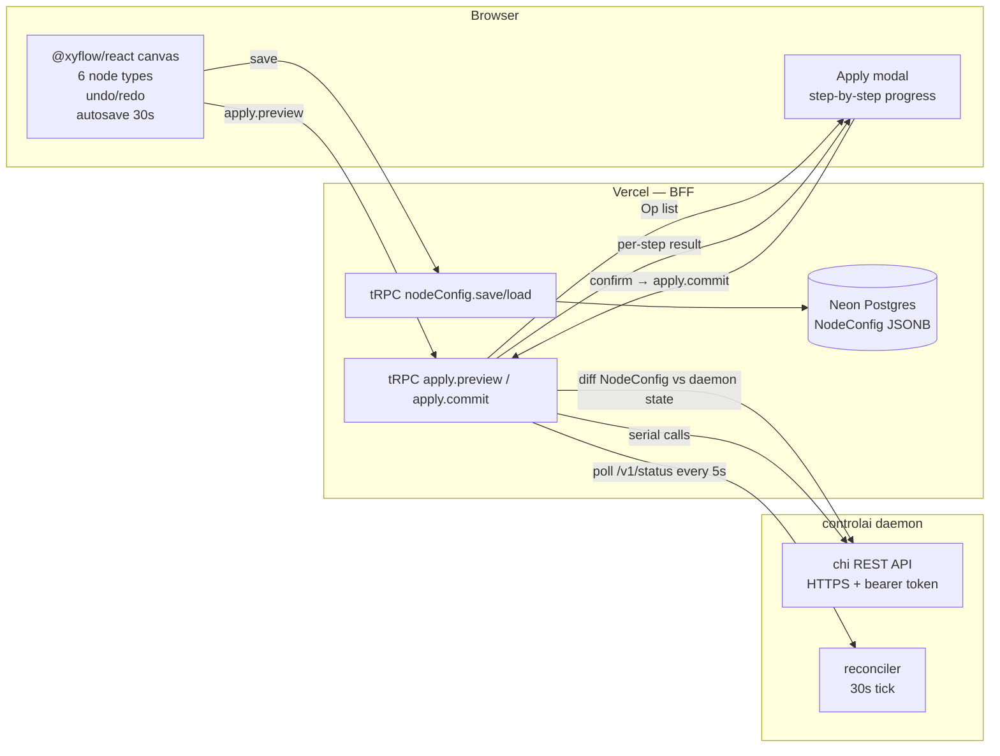
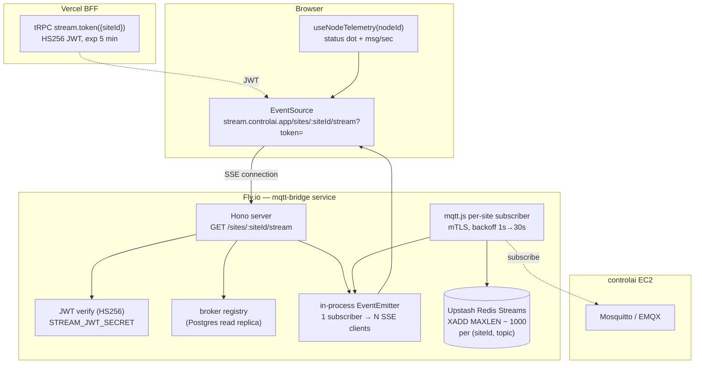
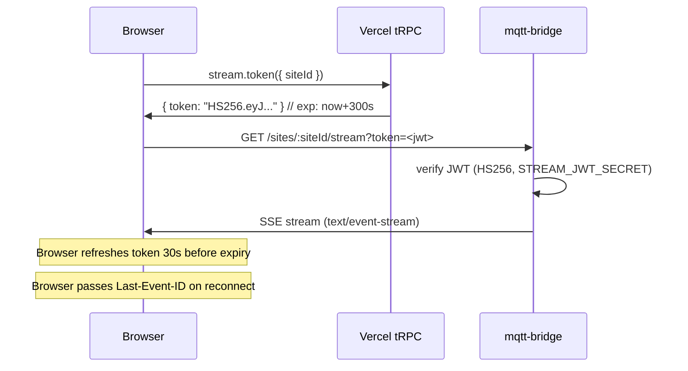

# Design: add-controlai-web-pipeline-ux

## Context

This change delivers the core product value of controlai-web on top of the skeleton.
It introduces the @xyflow/react node editor with 6 controlai-domain node types, the
two-phase Apply orchestration (preview → commit via daemon REST), the mqtt-bridge
real-time telemetry service, and the echarts dashboard. All design decisions from the
38-question interview are applied here (D2, D7–D11, D21–D26).

## Goals / Non-Goals

- **Goals**
  - @xyflow/react v12 canvas with 6 domain node types and connection validation
  - NodeConfig CRUD (save/load/version/setActive) via tRPC + Postgres JSONB
  - Undo/redo (Zustand store, 50-step buffer)
  - Apply: dry-run preview → confirm → serial daemon API calls with reconciler polling
  - mqtt-bridge: standalone Hono service, mqtt.js multi-broker, SSE fanout, Redis Streams
  - SSE JWT: Vercel tRPC `stream.token` mints short-lived HS256 JWT; browser sends as `?token=`
  - Live node overlays: status dot (green/yellow/red) + msg/sec counter per node
  - Dashboard: react-grid-layout per-SiteGroup, echarts widgets, Redis + TimescaleDB telemetry
- **Non-Goals**
  - Pipeline templates (D9 — v2)
  - Multi-site single graph view (D28 — v2)
  - Sparklines on nodes (D28 — v2, only status dot + msg/sec in v1)
  - Audit log UI (D35 — write-only in v1)
  - Per-project RBAC beyond Org role (D30 — v2)

## Architecture Diagrams

### Canvas → Apply → Daemon



### mqtt-bridge SSE Architecture



## Six Node Types

| Node Type | Icon | Daemon Resource | Port Handles | Config Fields |
|-----------|------|-----------------|--------------|---------------|
| Sensor | 📡 | External device (no daemon resource) | out: `data` | device_id, topic_prefix, qos |
| Gateway | 🔀 | None (logical edge device proxy) | in: `data`, out: `mqtt` | gateway_id, protocol |
| Broker | 📨 | Site broker (mosquitto/EMQX) | in: `mqtt`, out: `ingress` | kind (mosquitto\|emqx), throughput |
| Ingest | ⬇️ | Site ingest service | in: `ingress`, out: `tsdb` | direction (uni\|bi), batch_size |
| TimescaleDB | 🗄️ | Tenant TimescaleDB container | in: `tsdb` | retention (1m\|1h\|1d\|7d\|30d) |
| Monitoring | 📊 | No daemon resource (mqtt-bridge subscriber) | in: `ingress` | metrics (msg_rate, lag, error_rate) |

### Connection Matrix (`isValidConnection`)

```
Sensor    → Gateway ✓, Broker ✓
Gateway   → Broker ✓, Ingest ✓
Broker    → Ingest ✓, Monitoring ✓
Ingest    → TimescaleDB ✓, Monitoring ✓
TimescaleDB → Monitoring ✓
Monitoring → (terminal, no outgoing)
```

Any edge not in this matrix SHALL be rejected by `isValidConnection` with a toast message.

## Apply Plan Synthesis Algorithm

```
Input: NodeConfig.nodes + NodeConfig.edges, current daemon state (GET /v1/tenants, GET /v1/tenants/:id/sites)
Output: Plan { ops: Op[], planHash: string }

Op types:
  createTenant   → POST /v1/tenants
  createSite     → POST /v1/tenants/:id/sites
  updateSite     → PATCH /v1/tenants/:id/sites/:siteId
  issueCert      → POST /v1/tenants/:id/sites/:siteId/pki/certs
  updateIngest   → PATCH /v1/tenants/:id/sites/:siteId/ingest
  updateTsdb     → PATCH /v1/tenants/:id/tsdb

Algorithm:
1. For each Broker node in the graph: if no daemon Site exists → add createTenant + createSite ops.
2. For each Ingest node connected to a Broker: if ingest config differs from daemon → add updateIngest op.
3. For each TimescaleDB node: if retention config differs → add updateTsdb op.
4. For each Monitoring node: register in mqtt-bridge registry (no daemon call).
5. Order ops: createTenant → createSite → issueCert → updateIngest → updateTsdb.
6. Compute planHash = SHA256(JSON.stringify(sortedOps)).
```

## NodeConfig Persistence Shape

```typescript
// packages/db/prisma/schema.prisma (finalized)
model NodeConfig {
  id          String   @id @default(cuid())
  siteGroupId String
  version     Int      @default(1)
  nodes       Json     // @xyflow Node[]
  edges       Json     // @xyflow Edge[]
  isActive    Boolean  @default(false)
  appliedAt   DateTime?
  appliedHash String?  // SHA256 of the plan ops at apply time
  createdAt   DateTime @default(now())
  updatedAt   DateTime @updatedAt
  siteGroup SiteGroup @relation(fields: [siteGroupId], references: [id], onDelete: Cascade)
}
```

## SSE JWT Auth Flow



## Decisions

| # | Decision | Rationale |
|---|----------|-----------|
| D2 | Full CRUD + Apply in v1 | User explicitly asked for provisioning, not read-only visualization |
| D7 | 6 custom node types | Maps to controlai domain; sdi_oc's 21 node types are data-pipeline domain — not borrowed |
| D8 | Status dot + msg/sec (no sparkline) | Sparklines deferred to v2; status dot is sufficient for health at a glance |
| D9 | Templates in v2 | Out of scope; controlai's existing template renderer is not yet web-accessible |
| D10 | Upstash Redis Streams | `XADD MAXLEN ~ 1000` per (site,topic) gives "last 1000 msgs" bootstrap; Vercel edge-compatible |
| D21 | 6 node types | Sensor, Gateway, Broker, Ingest, TimescaleDB, Monitoring — maps to real infrastructure |
| D22 | SiteGroup = logical site; Site = 1:1 daemon Tenant+Site | Recommendation A — allows multiple broker protocols at one location |
| D23 | BFF-orchestrated serial apply | Prevents race conditions; reconciler polls between steps with 30s timeout per step |
| D24 | Phase 1: Fly.io for mqtt-bridge | Phase 2: EC2 sidecar; Phase 1 avoids new EC2 setup |
| D25 | SSE auth via ?token= short-lived JWT | Browser → mqtt-bridge is direct; no Vercel SSE (Vercel 60s function timeout) |
| D26 | Upstash Redis | `@upstash/redis` REST client, edge-compatible, free tier for PoC |
| D33 | mqtt-bridge stack: Hono + mqtt.js + ioredis | Lightweight Node.js server; Hono has native SSE support; mqtt.js is battle-tested |

### Alternatives Considered

- **MQTT over WebSocket in browser** — Rejected (D9): MQTT client in bundle adds ~200KB; single MQTT subscriber on bridge fans out to N browsers.
- **Vercel Streaming Response for SSE** — Rejected (D25): Vercel functions timeout at 60 s; mqtt-bridge on Fly.io has no timeout.
- **Apply via webhooks / event sourcing** — Rejected (D23): Serial BFF orchestration is simpler to reason about; rollback on failure is clear.
- **GraphQL instead of tRPC** — tRPC is already chosen for the skeleton; consistency over GraphQL's type advantages.

## Performance Budgets

| Metric | Budget |
|--------|--------|
| Max nodes per canvas | 50 (beyond this, @xyflow performance degrades on lower-end devices) |
| Max SSE clients per site | 20 (in-process EventEmitter; scale via Redis pub/sub in v2) |
| Redis Stream MAXLEN per (site,topic) | 1000 messages |
| Apply step timeout | 30 s per daemon API call + reconciler poll |
| Canvas autosave interval | 30 s (draft NodeConfig; not applied automatically) |
| SSE JWT TTL | 300 s (5 minutes) with 30 s refresh buffer |

## Risks / Trade-offs

- **Fly.io as mqtt-bridge host** — Additional infra; operators must deploy mqtt-bridge separately.
  Mitigation: `apps/mqtt-bridge/fly.toml` and `Dockerfile` provided; one-command deploy.
- **Apply partial failure** — If step 3 of a 5-step plan fails, the system is in a partially-provisioned
  state. Mitigation: Apply modal shows per-step status; operator can re-run Apply (idempotent: daemon
  `createTenant` returns 409 if tenant exists, treated as success by BFF).
- **mqtt.js mTLS cert management** — Each site needs client cert from the daemon's PKI. Mitigation:
  mqtt-bridge fetches cert from Postgres (stored by Apply provisioning step after `issueCert`).

## Open Questions

- Should the Apply modal support "undo apply" (tear down provisioned resources)? Current answer: no — decommission via manual `controlai tenant rm` for now; add UI in v2.
- Should NodeConfig versions be diff-viewable (like git diff)? Current answer: no — display version number only; diff view is v2.
