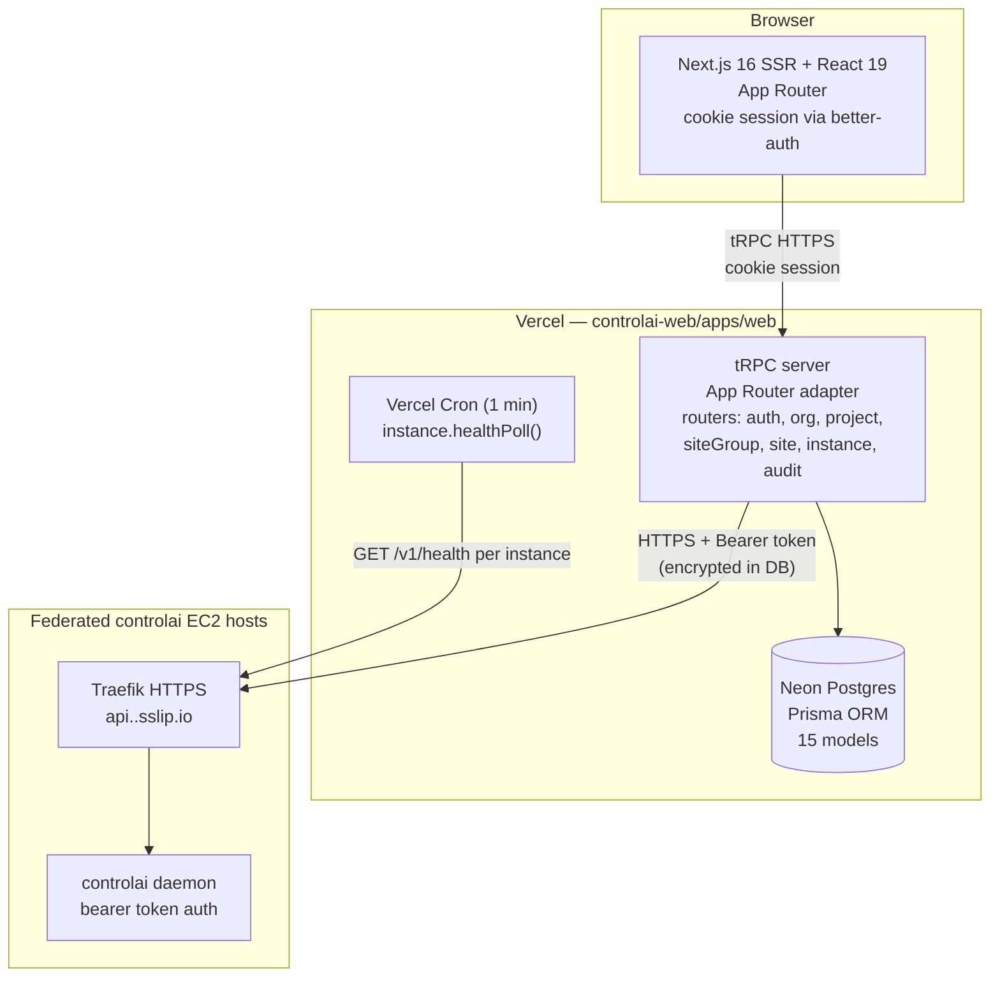
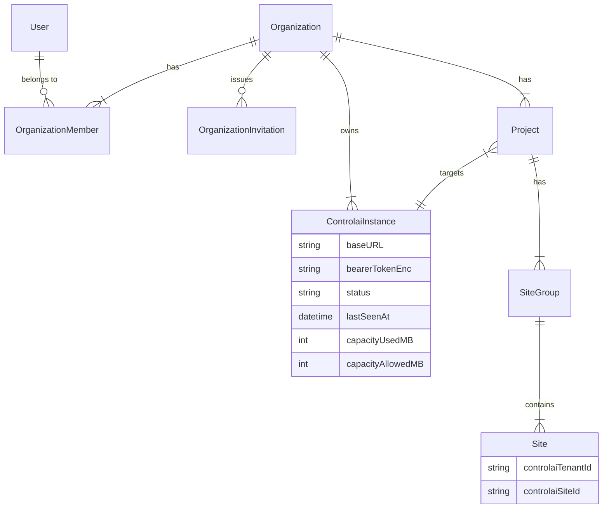

# Design: add-controlai-web-skeleton

## Context

`controlai` is a Go daemon that provisions IoT stacks (Mosquitto/EMQX broker → ingest → TimescaleDB)
per-tenant on a single EC2 host via docker-compose. It has no web frontend; operators use the CLI.
The user wants a multi-tenant web control plane: "account and project and thus site based
sensor-gateway-broker-ingest-timescale configuration provisioning and monitoring using a node editor."

This design covers the skeleton: monorepo, auth, domain model, and federation instance registry.
The node editor, provisioning, monitoring, and dashboard are in `add-controlai-web-pipeline-ux`.

Primary reference: **sdi_oc** (`/Users/8bitnyan/Documents/ThinkTank/sdi_oc/`) — Next.js 16 + tRPC +
Prisma + better-auth + @xyflow/react. ~80% of architecture decisions are borrowed from sdi_oc.
Secondary reference: **modules_cloud-main** — setup wizard 4-step state machine, cert/MQTT-user
lifecycle UX shape.

## Goals / Non-Goals

- **Goals**
  - Establish monorepo with pnpm workspaces + Turborepo
  - Auth: email+password sign-up/in (public, no email verification), session management, org invitations
  - Domain: Org → Project → SiteGroup → Site hierarchy with ABAC middleware
  - Federation: ControlaiInstance entity per org; Project has required `controlaiInstanceId`
  - Instance health polling: BFF polls `/v1/health` every 60 s, stores `lastSeenAt` + capacity stats
  - Setup wizard: first-run flow (signup → create org → add instance → done)
  - CI: GitHub Actions lint + typecheck + Vitest unit + Playwright E2E
- **Non-Goals**
  - Node editor, Apply provisioning, monitoring dashboards (→ `add-controlai-web-pipeline-ux`)
  - Per-project RBAC (D30 — Org OWNER/ADMIN edit; MEMBER view-only in v1)
  - Email verification (D6 — accept risk for dev-friendliness)
  - Pipeline templates (D9 — v2)
  - Kubernetes / multi-host orchestration (not in scope for this change)

## Architecture Diagram



## Domain Hierarchy



## Decisions

| # | Decision | Rationale |
|---|----------|-----------|
| D1 | Separate repo `8bitnyan/controlai-web` | Different language (TS vs Go), different release cadence, different deploy target |
| D3 | Hosting Phase 1: Vercel + Neon Postgres | Zero new infra; Vercel preview deploys for PR reviews; Neon serverless Postgres (D29) |
| D4 | Federation: one web ↔ many daemons | Org-scoped ControlaiInstance; Project has required `controlaiInstanceId` (D4, D15) |
| D5 | Public email+password sign-up | Open SaaS; no invite requirement at sign-up time (D5) |
| D6 | No email verification | Dev-friendly; documented risk of spam/abuse (D6, D17) |
| D11 | BFF→daemon auth: bearer token | Daemon CLI `controlai token create web-bff` issues token; stored AES-256-GCM encrypted in Postgres (D11, D34) |
| D13 | Project layer in controlai-web Postgres | Daemon gets only the opaque `project_id` tag via `add-project-tag` change |
| D15 | Instance: manual operator registration | Operator runs `controlai token create`, pastes URL+token into UI (D27) |
| D16 | Instance health: 60 s BFF poll | Vercel Cron 1-min interval; stores `lastSeenAt`, `version`, `capacityUsedMB/AllowedMB` (D16) |
| D20 | Hierarchy: User→Org→Instance→Project→SiteGroup→Site | SiteGroup is the user-facing logical site; Site is 1:1 with daemon Tenant+Site (D20, D22) |
| D29 | Neon Postgres | Serverless, free tier, compatible with `@neondatabase/serverless` Prisma adapter |
| D30 | ABAC: OWNER/ADMIN edit; MEMBER view | No per-project RBAC in v1; Org-level role is sufficient for PoC (D30) |
| D31 | Test stack: Vitest + Playwright | Vitest for unit + tRPC; Playwright for E2E happy paths (D31) |
| D32 | Setup wizard on first run | First user becomes sysadmin, creates first Org, prompted to add first Instance (D32) |
| D35 | Audit log write-only in v1 | `AuditLog` Prisma model + write path; no UI; visible via Prisma Studio (D35) |

### Alternatives Considered

- **Clerk for auth** — Vendor lock-in, paid, no self-host. Rejected in favour of better-auth (D5).
- **Drizzle ORM instead of Prisma** — sdi_oc is migrating to better-auth + Prisma; using same stack minimises divergence.
- **tRPC v11 → REST** — tRPC gives type-safe client, middleware chaining, and App Router adapter. No benefit from REST.
- **Single `controlai-web` capability spec** — Split into 4 (shell, auth, domain, instance-registry) for single-purpose per OpenSpec capability naming convention.

## Prisma Schema Highlights

```prisma
// packages/db/prisma/schema.prisma (abbreviated)

model User {
  id        String   @id @default(cuid())
  email     String   @unique
  name      String?
  createdAt DateTime @default(now())
  // better-auth relations
  sessions  Session[]
  accounts  Account[]
  memberships OrganizationMember[]
  auditLogs AuditLog[]
}

model Organization {
  id        String   @id @default(cuid())
  name      String
  slug      String   @unique
  createdAt DateTime @default(now())
  members   OrganizationMember[]
  invitations OrganizationInvitation[]
  instances ControlaiInstance[]
  projects  Project[]
}

model OrganizationMember {
  id     String @id @default(cuid())
  orgId  String
  userId String
  role   OrgRole
  org    Organization @relation(fields: [orgId], references: [id], onDelete: Cascade)
  user   User         @relation(fields: [userId], references: [id], onDelete: Cascade)
  @@unique([orgId, userId])
}

enum OrgRole { OWNER ADMIN MEMBER }

model ControlaiInstance {
  id                 String   @id @default(cuid())
  orgId              String
  name               String
  baseURL            String
  bearerTokenEnc     String   // AES-256-GCM encrypted, never plaintext in DB
  status             InstanceStatus @default(UNKNOWN)
  lastSeenAt         DateTime?
  version            String?
  capacityUsedMB     Int?
  capacityAllowedMB  Int?
  addedById          String
  createdAt          DateTime @default(now())
  org      Organization @relation(fields: [orgId], references: [id], onDelete: Cascade)
  addedBy  User         @relation(fields: [addedById], references: [id])
  projects Project[]
}

enum InstanceStatus { UNKNOWN HEALTHY DEGRADED UNREACHABLE }

model Project {
  id                 String   @id @default(cuid())
  orgId              String
  instanceId         String
  name               String
  createdAt          DateTime @default(now())
  org       Organization      @relation(fields: [orgId], references: [id], onDelete: Cascade)
  instance  ControlaiInstance @relation(fields: [instanceId], references: [id])
  siteGroups SiteGroup[]
}

model SiteGroup {
  id        String   @id @default(cuid())
  projectId String
  name      String
  createdAt DateTime @default(now())
  project   Project @relation(fields: [projectId], references: [id], onDelete: Cascade)
  sites     Site[]
}

model Site {
  id                String   @id @default(cuid())
  siteGroupId       String
  name              String
  controlaiTenantId String?  // populated after Apply
  controlaiSiteId   String?  // populated after Apply
  createdAt         DateTime @default(now())
  siteGroup SiteGroup @relation(fields: [siteGroupId], references: [id], onDelete: Cascade)
}

model AuditLog {
  id        String   @id @default(cuid())
  orgId     String
  userId    String?
  action    String
  targetId  String?
  targetType String?
  metadata  Json?
  createdAt DateTime @default(now())
  user User? @relation(fields: [userId], references: [id])
}
```

## Environment Variable Contract

| Variable | Required | Description |
|----------|----------|-------------|
| `DATABASE_URL` | Yes | Neon Postgres connection string |
| `BETTER_AUTH_SECRET` | Yes | 32-byte random string for session signing |
| `BETTER_AUTH_URL` | Yes | Public base URL (e.g. `https://controlai-web.vercel.app`) |
| `INSTANCE_TOKEN_KEY` | Yes | 32-byte AES-256-GCM key for bearer token encryption (hex) |
| `UPSTASH_REDIS_REST_URL` | Phase 2 | Upstash Redis REST URL (mqtt-bridge phase) |
| `UPSTASH_REDIS_REST_TOKEN` | Phase 2 | Upstash Redis REST token |
| `STREAM_SERVICE_URL` | Phase 2 | mqtt-bridge base URL |
| `STREAM_JWT_SECRET` | Phase 2 | HS256 shared secret for SSE JWT |
| `RESEND_API_KEY` | Optional | Transactional email for org invitations |

## Hosting

- **Phase 1**: Vercel (web app) + Neon Postgres + Vercel Cron for instance health polling.
  mqtt-bridge is **not part of this change** (→ `add-controlai-web-pipeline-ux`).
- **Phase 2**: Optionally containerize and deploy as Traefik sidecar on controlai EC2 host
  (`app.<deployment>.sslip.io → controlai-web:3000`). Documented in `add-controlai-web-pipeline-ux`.

## Risks / Trade-offs

- **Open sign-up abuse** — No email verification; anyone can register. Accepted risk (D6, D17).
  Mitigation: Vercel WAF rate-limits, noted in design; hard limit on number of orgs per user (5).
- **Single-region Neon** — Neon free tier is single-region; adds latency for non-US users. Acceptable for PoC.
- **Bearer token encryption key loss** — If `INSTANCE_TOKEN_KEY` is lost, all stored tokens must be
  re-entered manually. Mitigation: document key rotation procedure; store in Vercel secret.
- **Vercel Cron 1-min resolution** — Cannot poll faster than 1 min. Acceptable for health status display;
  real-time monitoring uses mqtt-bridge SSE (→ `add-controlai-web-pipeline-ux`).

## Open Questions

- Should the setup wizard be gated by a `setup_completed` row (like modules_cloud-main's `setup_state`
  singleton) or by checking whether any Org exists? Current answer: check for first Org + first Instance.
- Should Org slug be user-supplied or auto-generated? Current answer: user-supplied with uniqueness check.
