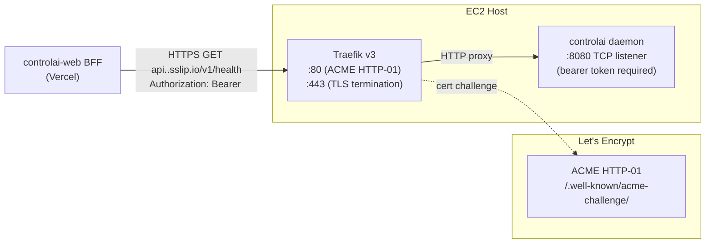

# Design: add-daemon-https-via-traefik

## Context

The controlai daemon exposes its REST API on a unix socket and an optional TCP listener.
`add-aws-provisioning` brought Traefik to the EC2 host to route tenant broker / HTTP
traffic. The upcoming `add-controlai-web-skeleton` spec describes a Vercel-hosted web BFF
that must call the daemon from outside the host. We need a public HTTPS endpoint for that.

Key constraint: the daemon binary must NOT change. Traefik already does TLS termination
and routing; we simply add one more router rule in a new Traefik dynamic-config file.

Stakeholders: operator (runs `up.sh`), controlai-web BFF (calls the API), Traefik (routes).

## Goals / Non-Goals

- **Goals**
  - Expose `api.<DEPLOYMENT_NAME>.sslip.io` → daemon REST (`http://127.0.0.1:<daemon_port>`)
  - Obtain a Let's Encrypt certificate automatically via ACME HTTP-01
  - Require `Authorization: Bearer <token>` (daemon already enforces this)
  - Update `up.sh` summary + smoke-test the new endpoint on first provision
  - Add integration test (`curl` from outside EC2 with a valid token)
- **Non-Goals**
  - Changing the daemon's TCP bind logic (already exists — just needs Traefik in front)
  - mTLS between Traefik and daemon (both on localhost; unnecessary)
  - Per-tenant subdomains under `api.` (all API paths share one route)
  - Rate-limiting, WAF, DDoS mitigate (D17 — nothing in v1, see `add-controlai-web-skeleton/design.md`)

## Architecture Diagram



### Traefik config additions (conceptual)

```yaml
# /etc/traefik/dynamic/api-<DEPLOYMENT_NAME>.yml
http:
  routers:
    api-<DEPLOYMENT_NAME>:
      rule: "Host(`api.<DEPLOYMENT_NAME>.sslip.io`)"
      entryPoints:
        - websecure
      tls:
        certResolver: letsencrypt
      service: controlai-daemon
      middlewares:
        - strip-nothing
  services:
    controlai-daemon:
      loadBalancer:
        servers:
          - url: "http://127.0.0.1:8080"
```

Traefik's static config (from `add-aws-provisioning`) already declares:
- `entryPoints.web` on :80 (used for ACME HTTP-01)
- `entryPoints.websecure` on :443
- `certificatesResolvers.letsencrypt` ACME config

## Decisions

| # | Decision | Rationale |
|---|----------|-----------|
| D14 | No daemon code change | Daemon already listens on configurable TCP; Traefik front-end is sufficient |
| — | ACME HTTP-01 vs DNS-01 | HTTP-01 is simpler — port 80 is already open in SG and Traefik already handles the challenge |
| — | No CORS on daemon | BFF → daemon calls are server-to-server; browser never contacts daemon directly |
| — | Staging LE first | Validate cert acquisition with LE staging before flipping to prod issuer to avoid rate-limit |
| — | Port 443 already open | Confirmed by `add-aws-provisioning` SG config; this change adds an explicit smoke-test assertion |
| — | Daemon bearer token scope | Existing `controlai token create web-bff` CLI creates a named token with full-API scope; no new scope logic needed |

### Alternatives Considered

- **Nginx reverse proxy** — Traefik is already on the host; adding Nginx would duplicate TLS plumbing.
- **daemon-side TLS (Go crypto/tls)** — Would require daemon code change and certificate management in Go code; Traefik handles this better.
- **Cloudflare Tunnel** — Zero-trust option, but requires Cloudflare account and changes the operator story; out of scope for self-hosted PoC.

## Risks / Trade-offs

- **Let's Encrypt rate limits** → Use staging issuer during development; switch to prod in `up.sh` via `ACME_STAGING=0` env flag.
- **sslip.io dependency** → If sslip.io is unreachable, cert issuance fails. Mitigated: operator can set a real domain via `DEPLOYMENT_DOMAIN` env; `up.sh` accepts this override.
- **Daemon TCP port conflict** → If daemon TCP port (default 8080) collides with another container, Traefik upstream fails. Mitigated: `up.sh` checks port availability before provision; `up.sh` reads daemon TCP port from SSM param.
- **Public API surface** → Bearer token is the only gate. Acceptable for PoC; `add-controlai-web-skeleton` notes this as an accepted risk (D17).

## Migration Plan

1. Deploy updated `deploy/aws/` files to an existing installation with `up.sh --update` (re-runs Traefik config only step).
2. Traefik hot-reloads dynamic config; cert acquired within ~30s.
3. Validate with `curl -H "Authorization: Bearer <token>" https://api.<dep>.sslip.io/v1/health`.
4. If cert fails: check port 80 open in SG, check `DEPLOYMENT_DOMAIN` env, check LE rate limit via `certbot certificates`.

Rollback: delete dynamic config file; Traefik hot-reloads, route disappears.

## Open Questions

- Should `up.sh` wait for cert issuance (poll `/v1/health` via HTTPS in a 2-min loop) or just print a "cert may take up to 60s" message? Current answer: poll 60s, then continue regardless.
- Should the bearer token be stored in SSM and injected into the BFF's Vercel env automatically? Current answer: operator pastes manually (D27 — manual instance registration).
